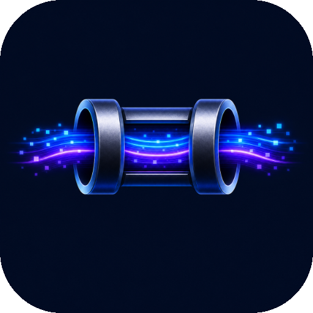

<p align="center">
  
</p>

<h1 align="center">OpenConduit</h1>

<p align="center">
  A cross-platform desktop AI chat application with multi-provider support and MCP tool integration.
</p>

<p align="center">
  <a href="https://github.com/OpenConduit/Client/releases"></a>
  <a href="https://github.com/OpenConduit/Client/actions/workflows/ci.yml"></a>
  <a href="LICENSE"></a>
</p>

---

## Features

- **Multiple AI providers** — OpenAI, Anthropic (Claude), LM Studio, and Ollama (local models via OpenAI-compatible API)
- **MCP tool servers** — connect any [Model Context Protocol](https://modelcontextprotocol.io) server over HTTP-SSE, HTTP Streamable, or stdio
- **Per-tool approval** — approve or deny individual tool calls before they execute, with per-server auto-approve override
- **Conversation management** — persistent conversations with custom titles, per-conversation provider/model selection, and context window tracking
- **System prompts** — global default and per-conversation system prompts
- **Parameter controls** — temperature, top-p, and max tokens configurable per conversation
- **Markdown rendering** — assistant responses rendered with syntax-highlighted code blocks
- **Export** — export conversations to Markdown
- **Auto-updates** — update checks via a Cloudflare Worker backed by GitHub Releases
- **Cross-platform** — macOS (Apple Silicon + Intel), Windows, and Linux

## Screenshots

> _Coming soon._

## Download

Pre-built binaries are available on the [Releases](https://github.com/OpenConduit/Client/releases) page.

| Platform | Format |
|---|---|
| macOS (Apple Silicon) | `.zip` |
| macOS (Intel) | `.zip` |
| Windows | Squirrel installer (`.exe`) |
| Linux | `.deb` / `.rpm` |

## Tech Stack

| Layer | Technology |
|---|---|
| Runtime | Electron 42 |
| Frontend | React 19, TypeScript, Tailwind CSS v4, Vite |
| State | Zustand v5 with `persist` middleware |
| Main-process storage | `electron-store` v11 |
| Build / package | electron-forge |
| Update server | Cloudflare Worker |

## Getting Started

### Prerequisites

- Node.js 20 or later
- npm 10 or later

### Install & run

```bash
git clone https://github.com/OpenConduit/Client.git
cd Client
npm install
npm start
```

### Build a distributable

```bash
# Current platform
npm run make

# macOS only
npm run make -- --platform darwin

# Windows only
npm run make -- --platform win32
```

Output lands in `out/make/`.

## Configuration

On first launch, open **Settings** (⌘, on macOS) and add at least one AI provider:

| Provider | Required fields |
|---|---|
| OpenAI | API key, default model |
| Anthropic | API key, default model |
| LM Studio | Base URL (e.g. `http://localhost:1234`), default model |
| Ollama | Auto-detected at `http://localhost:11434`, optional Base URL override, default model |

### MCP Servers

Add MCP tool servers in **Settings → MCP Servers**. Supported transports:

- **HTTP-SSE** — URL + optional headers
- **HTTP Streamable** — URL + optional headers  
- **stdio** — command, args, and optional environment variables

## Project Structure

```
src/
  main.ts                   # Electron entry point
  preload.ts                # Context bridge (window.api)
  main/
    ipc.ts                  # All IPC handlers
    providers/              # AI provider clients
    mcp/client.ts           # MCP client
    store/settings.ts       # electron-store (main process)
  renderer/
    App.tsx                 # Root component
    components/             # UI components
    hooks/                  # Chat lifecycle hooks
    stores/                 # Zustand stores (renderer)
  shared/
    types.ts                # Shared TypeScript types
worker/                     # Cloudflare Worker (update checks + feedback)
```

## Releasing

Releases are fully automated via [release-please](https://github.com/googleapis/release-please).

**How it works:**

1. Merge commits to `main` using [Conventional Commits](https://www.conventionalcommits.org) — e.g. `feat: add X`, `fix: Y`, `chore: Z`
2. The `release-please` GitHub Action automatically opens/maintains a **Release PR** titled `chore: release X.Y.Z` that:
   - Bumps the version in `package.json`
   - Updates `CHANGELOG.md` with entries grouped by type
3. When you're ready to ship, **merge the Release PR**
4. release-please creates the git tag (e.g. `v1.1.0`), which triggers the `release.yml` workflow → builds macOS DMG, Windows EXE, Linux deb/rpm → creates a draft GitHub Release
5. Go to [Releases](https://github.com/OpenConduit/Client/releases), review the draft, and publish

**Commit types and their effect:**

| Prefix | Changelog section | Version bump |
|---|---|---|
| `feat:` | Features | minor (`1.0.x` → `1.1.0`) |
| `fix:` | Bug Fixes | patch (`1.0.0` → `1.0.1`) |
| `feat!:` / `BREAKING CHANGE:` | ⚠ Breaking Changes | major (`1.x.x` → `2.0.0`) |
| `docs:`, `chore:`, `ci:` | _(not shown)_ | none |
| `perf:` | Performance Improvements | patch |
| `refactor:` | _(not shown)_ | none |

**Key files:**
- `release-please-config.json` — release-please configuration
- `.release-please-manifest.json` — tracks the last released version (updated automatically, don't edit manually)
- `.github/workflows/release-please.yml` — runs on every push to `main`
- `.github/workflows/release.yml` — triggered by the version tag; builds and uploads artifacts

## Contributing

1. Fork the repo and create a branch from `main`
2. Run `npm run lint` and ensure it passes before opening a PR
3. Fill out the pull request template — in particular the **Process Boundary Check** section (no Node/Electron imports in renderer files)
4. Sign the [Contributor License Agreement](CLA.md) — the CLA bot will prompt you on your first PR

## License

OpenConduit is source-available under the [GNU AGPL v3.0](LICENSE) for personal and open-source use. A separate [commercial license](LICENSE-COMMERCIAL) is available for commercial deployments — contact [contact@openconduit.ai](mailto:contact@openconduit.ai) for details.
